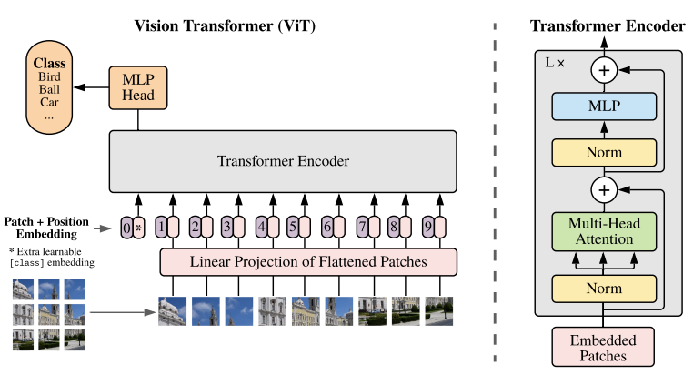

对Vision Transformer架构的简单复现，在 MacBook Air M1 上对MNIST数据集训练了50的epoch，在测试集上的准确率高于 98%。

主要参考[该视频](https://www.bilibili.com/video/BV13K421h79z?spm_id_from=333.788.player.switch&vd_source=2bfbdd4fe05b01e4b33773a718e322a1&trackid=web_related_0.router-related-2479604-tn27s.1776492883324.195)，对架构稍作修改。

----------------------------
## 架构 (ICLR 2021)


 
### 分割图片并线性投影

以一个  1x28x28 大小的图片 (Channel = 1, H = W = 28)，patch大小为4x4为例。
对每一个patch，我们把它展平成一个一维长 embedding 形式，方便传入Transformer。经过Linear Projection 之后，1x28x28 大小的图片应该转化为 16x49 大小的 token 序列，即共有49个token，每个token的embedding长度为16。

实际上，这个线性投影等价于一个卷积层，所以我们也可以直接用一个卷积层实现线性投影逻辑。
```
self.conv=nn.Conv2d(
	#输入图片只有一个通道，是灰度图，如果是RGB图，这里是3
	in_channels=1,  
	#每个4*4的patch被展平后的是16
	out_channels=self.patch_size**2,  
	kernel_size=self.patch_size,  
	padding=0,
	stride=self.patch_size  
	) 
```

### 添加 cls token
cls token是一个特殊的token，长度为embedding_size，这是BERT类模型的常用设计，它会被拼接到线性投影后的序列的头部，最终用来代表整个图像的全局特征。

### 添加 pos embedding
pos embedding是随机初始化的，可学习的embedding。它直接加到每一个token上，形成最终的输入。

### Transformer Encoder
不涉及padding时，不需要mask，直接传入transformer encoder层。此处可以叠加多个encoder。

### MLP head
只取0号token位置的输出，即cls token位置的输出，经过mlp head，得到最终分类结果（类别长度的logits）。例如，对于一个识别手写数字0-9的ViT，如果我们输入了5张手写数字图片（5x1x28x28），最终会得到 5x10 大小的输出，第二维度为该图片为 0-9 对应数字的 logit。